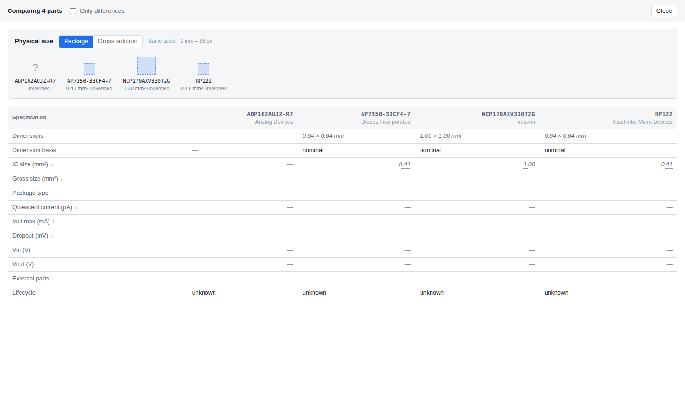
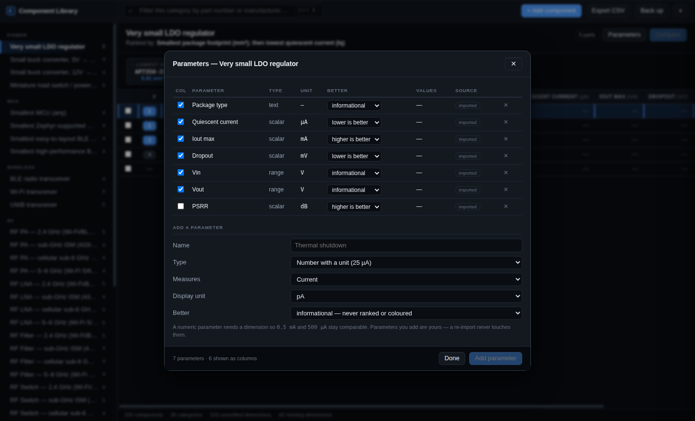
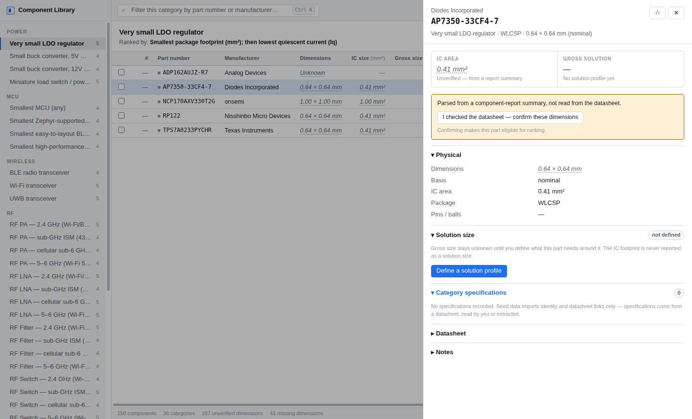
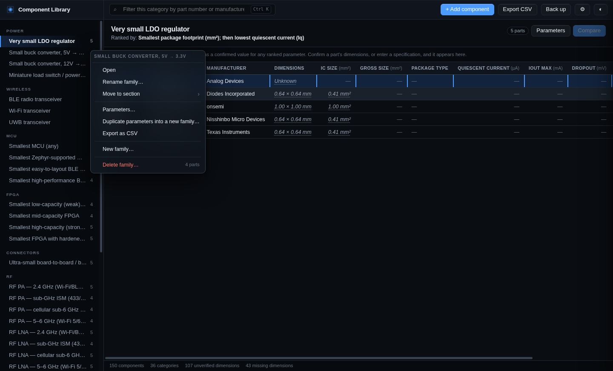
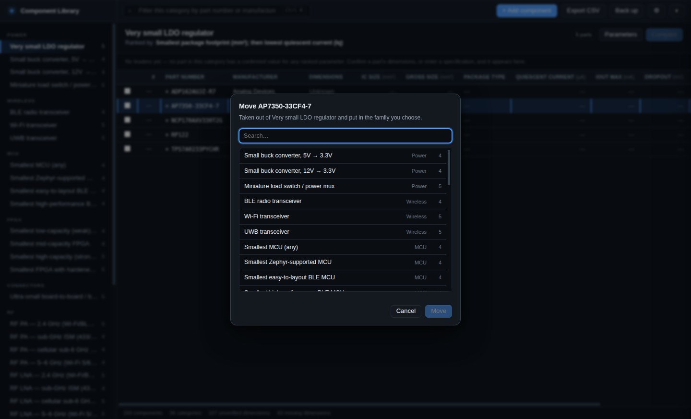
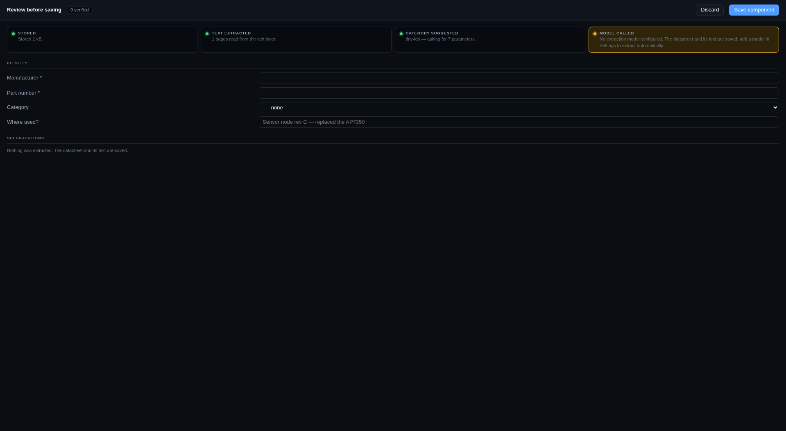

# Component Library

A local, offline desktop database for electronic components, built for one question:

> **How much board area does this part actually cost me?**

Not the package size. The *solution* size — the IC plus the crystal, the inductor, the
decoupling caps and the RF matching network you cannot ship without.

This is not an inventory or BOM tool. It is a parts-selection instrument: dense
comparison tables inside engineering categories, ranked by what actually matters in each
one, with every number traceable to where it came from.


---

## Status

**Phases 1–4 complete.** The app builds, launches and does the job.

| Area | State |
|---|---|
| Unit system (SI, ranges, logarithmic, binary capacity) | ✅ 22 tests |
| Package dimensions (min/nom/**max**), IC area | ✅ |
| Gross solution size (externals, profiles, estimator, override) | ✅ 22 tests |
| Category model + spec lexicon + `component-report` importer | ✅ 22 tests |
| SQLite schema, migrations, non-destructive sync | ✅ 15 tests |
| Ranking engine (ordered rules, hard requirements) | ✅ 13 tests |
| Electron shell, secure IPC, renderer | ✅ |
| Category tables, search, duplicate detection, seed | ✅ 20 integration tests |
| Component create + spec editing + annotations | ✅ 25 tests |
| Compare view + scaled size visualization | ✅ 12 tests |
| Solution profiles and externals editing | ✅ |
| JSON backup + CSV export | ✅ |
| Coloured ranks + per-parameter leaders | ✅ 22 colour-contrast tests |
| Add / edit / remove category parameters | ✅ 23 tests |
| Datasheets stored in the database + per-page OCR text | ✅ |
| Local API for an offline AI agent | ✅ 26 round-trip tests |
| Windows standalone packaging | ✅ config proven; installer builds in CI |
| **Drop PDF → review → save**, entirely in-app | ✅ 30 pipeline tests |
| In-app PDF text extraction (pdf.js) | ✅ |
| Import review screen with highlighted evidence | ✅ |
| "Where used?" per component | ✅ |
| Scanned-PDF OCR inside the app | ⏳ post-V1 — post OCR text via the local API — contract, schemas and evidence verifier built and tested (24 tests); no model is called yet |

`npm test` → **322 passing**. `npm run typecheck` and `npm run lint` → clean.

`tests/acceptance.test.ts` walks the brief's twenty V1 criteria as a single session:
import the taxonomy → add an MCU, an LDO and a flash device by hand → store max
dimensions → define externals → read IC and gross area → toggle an external and watch
gross size move → create two solution profiles → browse, filter, rank → compare three
parts → read the size rectangles → export and back up.

### Comparison and size visualization



### Editable parameters

Every category's parameters can be added, retyped, hidden or removed from inside the
app — no code change, and a re-import never puts back something you removed.



### Component detail



### Organise it the way you think about it

Right-click anything. Families can be renamed, created, duplicated, moved between sections
and deleted; sections can be renamed, reordered, created and deleted; parts can be moved
between families, added to a second one, or bulk-edited from a selection.



Because a part can belong to several families at once, **move** and **also add** are
separate commands. And nothing is deleted before it is counted: removing a family that
holds the only membership of forty parts tells you so and asks where they should go,
rather than leaving them in no family at all.



Everything you rearrange survives the next re-import — renames, placements and deletions
all leave a record the sync respects.

---

## The rules this codebase is built to enforce

These are not style preferences. Each one has a test that fails when it is violated.

1. **Maximum package dimensions win.** If a datasheet gives nominal 2.5 × 2.0 and maximum
   2.6 × 2.1, the area is **5.46 mm²**, not 5.00. Quietly using the nominal understates
   every comparison by a few percent — small enough to look correct.
2. **IC size and gross solution size are never the same field.** Nothing in the code
   aliases one to the other.
3. **Numbers are numbers.** `0.5 mA` and `500 µA` are the same value. Presentation strings
   are never the source of truth for a comparison.
4. **Missing means missing.** An unknown dimension does not become zero and rank the part
   as the smallest. It stays `Unknown` and is excluded from ranking.
5. **Manual edits win.** A value you corrected is never overwritten by a later extraction
   without your explicit approval.
6. **Nothing is invented.** A specification the source did not state is stored as `null`.
7. **Re-import never destroys local work.** Categories you edited are kept and reported.
8. **Evidence is checked, not trusted.** An extracted value must quote the datasheet, and the
   quote is searched for in the text of the page it cites. Unverifiable values are refused.

---

## Why it exists

[`kobimoneh/component-report`](https://github.com/kobimoneh/component-report) already
researches and ranks parts across 36 categories every month — but its output is prose in a
Markdown/PDF newsletter. You cannot sort it, filter it, or ask it about board area.

This app is the queryable form of that knowledge. It imports the same category taxonomy so
the two stay in step, then lets the definitions grow here without touching source code.

---

## Where it goes next

[docs/ROADMAP.md](docs/ROADMAP.md) — four independent reviews of the shipped code, and the
ten things that would take it from a well-built table to a tool nothing else replaces.
It opens with the finding that matters most: gross solution size, the reason this app
exists, is hardcoded `null` in every table.

## Documentation

| Document | Covers |
|---|---|
| [PRODUCT_SPEC.md](docs/PRODUCT_SPEC.md) | What it does, who for, acceptance criteria |
| [ARCHITECTURE.md](docs/ARCHITECTURE.md) | Process model, module boundaries, security |
| [DATA_MODEL.md](docs/DATA_MODEL.md) | SQLite schema and the hybrid spec model |
| [CATEGORY_SCHEMA.md](docs/CATEGORY_SCHEMA.md) | Dynamic categories, the spec lexicon, sync |
| [GROSS_SIZE_MODEL.md](docs/GROSS_SIZE_MODEL.md) | The four measurements and the estimator |
| [DATASHEET_EXTRACTION.md](docs/DATASHEET_EXTRACTION.md) | AI ingestion, provenance, anti-hallucination |
| [UX.md](docs/UX.md) | Screens, interaction, motion policy |
| [COLOUR.md](docs/COLOUR.md) | Rank ramp, best/worst, contrast arithmetic |
| [AI_INTEGRATION.md](docs/AI_INTEGRATION.md) | **Driving the app from a local, offline model** |
| [DECISIONS.md](docs/DECISIONS.md) | Engineering decisions and why they were made |

---

## Development

Requires Node 22.5+ (24.x recommended — it matches the Node that Electron 43 bundles).

```bash
npm install
npm test          # vitest
npm run typecheck # tsc --noEmit
npm run dev       # electron-vite dev
```

There are **no native modules**. The database is `node:sqlite`, built into the Node that
Electron bundles, so there is no `node-gyp` step and no ABI mismatch between the test
runner and the app.

### Windows — standalone install

Two artifacts, both unsigned personal builds:

- `ComponentLibrary-<version>-x64.exe` — NSIS installer, per-user, choose your directory,
  start-menu and desktop shortcuts.
- `ComponentLibrary-<version>-portable.exe` — single file, no install, runs from a stick.

Built by [`.github/workflows/build-windows.yml`](.github/workflows/build-windows.yml) on
every push, downloadable from the run's artifacts; tagging `v*` attaches them to a release.

To build locally **on Windows**: `npm ci && npm run package:win`.

Cross-building from Linux gets as far as `release/win-unpacked/Component Library.exe` and
then fails — electron-builder needs wine to embed the icon into the executable. That is why
the installer is built on a Windows runner rather than here.

The app is fully self-contained: no runtime to install, no `node-gyp`, no native modules.
Your database lives in `%APPDATA%\component-library\components.sqlite`.

**Installing on a machine with no network.** Copy one `.exe` across and run it. Everything
first run needs is inside: the category taxonomy, the 150 seed parts, the OCR engine and
its English training data. Nothing is fetched. The first launch creates the database,
applies the migrations and imports the taxonomy, which takes a second or two.

**SmartScreen will warn on first run** — "Windows protected your PC" → *More info* → *Run
anyway*. The build is unsigned, because signing needs a code-signing certificate. Nothing
is wrong with the file.

**Moving your library to another machine.** Use `Back up` to write the whole database as
JSON, or just copy `components.sqlite`. It is a plain SQLite file with no external
references — no cloud account, no lock-in.

### Linux

`npm run package:linux` produces `release/Component Library-<version>.AppImage`: a single
executable file, `chmod +x` and run. Built and verified here.

### What is in the package, and what was left out

The Windows installer is roughly 100 MB and about 380 MB installed; most of that is
Electron's own Chromium. Of what this project adds, the largest single item is the bundled
OCR engine and English training data (~16 MB) — deliberate, because a datasheet tool that
needs a CDN on first use is no use on the machine it exists for.

Excluded from the package after checking each is genuinely unreachable at runtime:
pdf.js's modern build, image decoders and web viewer (only the `legacy` build is loaded),
all source maps, and `@napi-rs/canvas` — pdf.js's **Node** canvas factory, which is only
reached when rendering a page in the main process, and rendering happens in the renderer
on the browser's own canvas. Together, 60 MB.

Verified rather than assumed: after trimming, the packaged binary was run again on all
three paths that could have broken — first-run migrate and seed, pdf.js text extraction in
the main process, and WebAssembly OCR in the renderer under the production CSP.

### Drop a datasheet



Drag a PDF anywhere onto the window — or press **+ Add component**, which leads with the
datasheet and keeps typing-it-by-hand as the fallback. The app stores it in the database, reads its text,
**OCR-ing any page with no text layer**, guesses the category from the document's own words,
asks your model for that category's parameters, checks every quote against the page it cites,
and shows you the result. Nothing is written to the library until you press **Save**.

OCR runs as WebAssembly in the renderer with the language data bundled, so a scanned
datasheet works with no network, no extra install and no worker script.

Point it at a model in **⚙ → Extraction model**: any OpenAI-compatible server works —
Ollama, llama.cpp, LM Studio, vLLM. With no model configured the drop still stores the
document and its searchable text, and says so.

### Offline AI ingestion

There is a loopback-only, token-authenticated HTTP API for pointing a **locally running
model** at the library — upload datasheets, post your own OCR text, and propose extracted
values. Datasheet bytes are stored *in* the database, so it stays one portable file.

The contract is one-way: **an agent may propose, only a human applies.** Every proposed
value has its quote verified against the stored page text before it is even queued.

Off by default. See [AI_INTEGRATION.md](docs/AI_INTEGRATION.md).

---

## Licence

Not yet licensed. Personal project.
