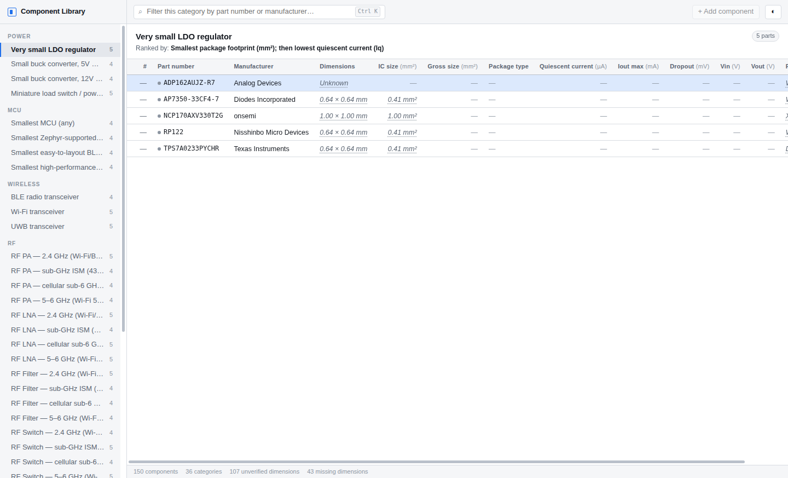

# Component Library

A local, offline desktop database for electronic components, built for one question:

> **How much board area does this part actually cost me?**

Not the package size. The *solution* size — the IC plus the crystal, the inductor, the
decoupling caps and the RF matching network you cannot ship without.

This is not an inventory or BOM tool. It is a parts-selection instrument: dense
comparison tables inside engineering categories, ranked by what actually matters in each
one, with every number traceable to where it came from.



---

## Status

Foundation complete and tested. The application shell and UI are in progress.

| Area | State |
|---|---|
| Unit system (SI, ranges, logarithmic, binary capacity) | ✅ Built, 22 tests |
| Package dimensions (min/nom/**max**), IC area | ✅ Built |
| Gross solution size (externals, profiles, estimator, override) | ✅ Built, 22 tests |
| Category model + spec lexicon + `component-report` importer | ✅ Built, 22 tests |
| SQLite schema, migrations, non-destructive sync | ✅ Built, 15 tests |
| Ranking engine (ordered rules, hard requirements) | ✅ Built, 13 tests |
| Electron shell, secure IPC, renderer | ✅ Built, launches |
| Category tables, search, duplicate detection, seed | ✅ Built, 20 integration tests |
| Component CRUD (create/edit forms) | ⏳ Phase 2 |
| Compare view, size visualization | ⏳ Phase 3 |
| Solution profile + externals editing UI | ⏳ Phase 4 |
| Datasheet AI ingestion | ⏳ Phase 5 — interfaces stubbed, nothing calls a model yet |

`npm test` → **125 passing**. `npm run typecheck` → clean. The app builds and runs.

---

## The rules this codebase is built to enforce

These are not style preferences. Each one has a test that fails when it is violated.

1. **Maximum package dimensions win.** If a datasheet gives nominal 2.5 × 2.0 and maximum
   2.6 × 2.1, the area is **5.46 mm²**, not 5.00. Quietly using the nominal understates
   every comparison by a few percent — small enough to look correct.
2. **IC size and gross solution size are never the same field.** Nothing in the code
   aliases one to the other.
3. **Numbers are numbers.** `0.5 mA` and `500 µA` are the same value. Presentation strings
   are never the source of truth for a comparison.
4. **Missing means missing.** An unknown dimension does not become zero and rank the part
   as the smallest. It stays `Unknown` and is excluded from ranking.
5. **Manual edits win.** A value you corrected is never overwritten by a later extraction
   without your explicit approval.
6. **Nothing is invented.** A specification the source did not state is stored as `null`.
7. **Re-import never destroys local work.** Categories you edited are kept and reported.

---

## Why it exists

[`kobimoneh/component-report`](https://github.com/kobimoneh/component-report) already
researches and ranks parts across 36 categories every month — but its output is prose in a
Markdown/PDF newsletter. You cannot sort it, filter it, or ask it about board area.

This app is the queryable form of that knowledge. It imports the same category taxonomy so
the two stay in step, then lets the definitions grow here without touching source code.

---

## Documentation

| Document | Covers |
|---|---|
| [PRODUCT_SPEC.md](docs/PRODUCT_SPEC.md) | What it does, who for, acceptance criteria |
| [ARCHITECTURE.md](docs/ARCHITECTURE.md) | Process model, module boundaries, security |
| [DATA_MODEL.md](docs/DATA_MODEL.md) | SQLite schema and the hybrid spec model |
| [CATEGORY_SCHEMA.md](docs/CATEGORY_SCHEMA.md) | Dynamic categories, the spec lexicon, sync |
| [GROSS_SIZE_MODEL.md](docs/GROSS_SIZE_MODEL.md) | The four measurements and the estimator |
| [DATASHEET_EXTRACTION.md](docs/DATASHEET_EXTRACTION.md) | AI ingestion, provenance, anti-hallucination |
| [UX.md](docs/UX.md) | Screens, interaction, motion policy |
| [DECISIONS.md](docs/DECISIONS.md) | Engineering decisions and why they were made |

---

## Development

Requires Node 22.5+ (24.x recommended — it matches the Node that Electron 43 bundles).

```bash
npm install
npm test          # vitest
npm run typecheck # tsc --noEmit
npm run dev       # electron-vite dev
```

There are **no native modules**. The database is `node:sqlite`, built into the Node that
Electron bundles, so there is no `node-gyp` step and no ABI mismatch between the test
runner and the app.

### Windows packaging

```bash
npm run package:win   # electron-builder NSIS
```

Development happens under WSL/Linux; the Windows installer is produced on Windows (or a
`windows-latest` CI runner). No wine is required for the Linux build.

---

## Licence

Not yet licensed. Personal project.
