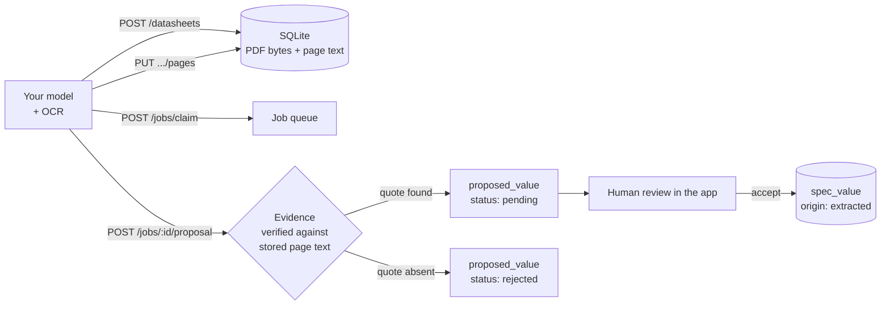

# Offline AI Integration

How to point a locally-running model at this database and let it read datasheets,
fill in specifications, and improve the library — without ever being able to
corrupt it.

Everything here works with **no network**. Nothing calls a cloud service.

---

## The one rule

> **An agent may propose. Only a human applies.**

There is no endpoint that writes a confirmed specification. An agent can create
components, store datasheets, post OCR text and submit extracted values — and
every extracted value lands in a review queue with its evidence already checked
against the page it claims to come from.

This is what makes "run it against a big database with a local model" a safe
idea. The model can be wrong at scale; being wrong at scale produces a review
queue, never a corrupted library.



---

## Turning it on

The API is **off by default** and binds **127.0.0.1 only** — it is not reachable
from your network by configuration, not merely by firewall.

```sql
-- In the app's database (~/.config/component-library/components.sqlite on Linux,
-- %APPDATA%\component-library\ on Windows)
UPDATE setting SET value = 'true' WHERE key = 'api.enabled';
-- or, first time:
INSERT INTO setting (key, value) VALUES ('api.enabled', 'true');
```

Restart the app. It prints the port on stdout. A token is generated on first run:

```sql
SELECT value FROM setting WHERE key = 'api.token';
```

Every request must send it:

```
X-API-Token: <token>
```

Default port `8917`; change with the `api.port` setting. The token is compared in
constant time, so it cannot be guessed by timing.

---

## Endpoints

Base: `http://127.0.0.1:8917`

### Reading the library

| Method | Path | Returns |
|---|---|---|
| `GET` | `/health` | `{ ok: true, api: 1 }` |
| `GET` | `/categories` | All categories with component counts |
| `GET` | `/categories/:slug/parameters` | **What this category cares about** — key, type, unit, dimension, better-direction |
| `GET` | `/categories/:slug/columns` | The table columns, in order |
| `GET` | `/categories/:slug/components?q=` | Rows with formatted cells and ranks |
| `GET` | `/components/search?q=&limit=` | Search by MPN, manufacturer, notes |
| `GET` | `/components/:id` | Full detail: package, specs, solution size, externals |
| `GET` | `/stats` | Queue and storage counters |

`GET /categories/:slug/parameters` is the important one. It tells the model
exactly which parameters matter for this category, what unit each expects, and
whether lower or higher is better — so the prompt can ask for the right things
instead of guessing.

### Components

```http
POST /components
Content-Type: application/json

{ "manufacturer": "Texas Instruments", "mpn": "TPS7A0233PYCHR",
  "categorySlug": "tiny-ldo", "lifecycle": "active",
  "package": { "name": "DSBGA-4", "xMax": 0.665, "yMax": 0.665, "zMax": 0.36 } }
```

→ `200 { "id": 42 }`, or **`409`** with the existing part:

```json
{ "error": "Duplicate", "duplicate": { "id": 7, "mpn": "TPS7A0233PYCHR", "manufacturer": "Texas Instruments" } }
```

A duplicate is never overwritten. Enter the exact ordering code for a different
package variant — a family in QFN, BGA and WLCSP is three components, because
each has a different size and size is the point.

**Always send `xMax`/`yMax`, not nominal dimensions**, when the datasheet states
maxima. Area comparison uses the maximum, and quietly substituting the nominal
understates every comparison by a few percent.

### Datasheets — bytes live in the database

```http
POST /datasheets?componentId=42&title=TPS7A02
Content-Type: application/pdf

<raw PDF bytes>
```

→ `{ "id": 9, "deduplicated": false, "sha256": "…" }`

Content is deduplicated by SHA-256: the same PDF posted twice is one row. The
bytes are stored **in** SQLite, not beside it, so the database stays a single
portable file.

| Method | Path | Purpose |
|---|---|---|
| `GET` | `/datasheets?componentId=` | List, with byte size and text status |
| `GET` | `/datasheets/:id/content` | The original bytes back, byte-for-byte |
| `GET` | `/datasheets/:id/pages` | Stored page text |
| `PUT` | `/datasheets/:id/pages` | **Post your OCR output** |
| `GET` | `/datasheets/pages/search?q=` | Find the page holding a parameter |

### Posting OCR text

```http
PUT /datasheets/9/pages
{
  "engine": "tesseract-5.3",
  "pages": [
    { "page": 13, "text": "IQ Quiescent current, no load 25 nA",
      "method": "ocr", "confidence": 0.88 }
  ]
}
```

`method` is one of `text-layer`, `ocr`, `vision`, `none`. It matters: the
document's overall status becomes the **weakest** method used on any page, so a
datasheet that needed OCR anywhere is never presented as if it had a clean text
layer.

**This step is not optional.** Evidence verification checks quotes against this
stored text. Without it, every value you propose will be rejected as unverifiable
— which is the correct behaviour, not a bug.

`GET /datasheets/pages/search?q=quiescent` is how you avoid sending fifty pages
to a model. Find the page, read that page, extract from it.

### The job queue

```http
POST /jobs            { "datasheetId": 9, "componentId": 42, "categoryHint": "tiny-ldo" }
POST /jobs/claim      { "worker": "local-llm-1" }     → the job, or { "empty": true }
POST /jobs/:id/fail   { "error": "PDF is encrypted" }
GET  /jobs?status=queued
```

Claiming is atomic. Two workers polling simultaneously cannot take the same job —
the second one's conditional update changes no rows and it gets `{ empty: true }`.
Run as many workers as you have cores.

### Proposing values

```http
POST /jobs/5/proposal
{
  "fields": [
    { "target": "spec", "specKey": "iq", "value": "25 nA", "unit": "nA",
      "page": 13, "evidence": "IQ Quiescent current, no load 25 nA", "confidence": 0.9 },

    { "target": "spec", "specKey": "psrr", "value": null, "confidence": 0.2 }
  ]
}
```

→

```json
{ "jobId": 5, "accepted": 1, "rejected": 0, "reportedUnknown": 1,
  "details": [ { "specKey": "iq", "status": "pending", "reason": "Quote confirmed on page 13." },
               { "specKey": "psrr", "status": "rejected", "reason": "Reported as not found. Stored as Unknown." } ] }
```

**`value: null` is a legitimate, expected answer.** It means you looked and did
not find it. It needs no evidence and is not a failure. Inventing a plausible
number instead is the single worst thing this system can do.

---

## Evidence verification — why your quotes matter

Every non-null field must carry a verbatim `evidence` quote and the `page` it
came from. Before anything is stored, that quote is searched for in the text you
posted for that page.

| Outcome | Meaning |
|---|---|
| `verified` | Quote found. Stored as `pending`, ready for review. |
| `not-found` | Quote is not on that page. **Rejected.** |
| `page-missing` | You cited a page with no stored text. **Rejected.** |
| `no-evidence` | No quote supplied. **Rejected.** |
| `null-value` | Honest "not found". Recorded, not counted as a failure. |

Comparison is whitespace- and case-insensitive and normalizes unicode dashes,
quotes, soft hyphens and both micro signs, because PDF extraction mangles all of
them. A quote found on an adjacent page is accepted with a note, since tables
straddle pages.

The point: to fabricate a number you would also have to fabricate a quote that
happens to appear in the PDF. That converts an unfalsifiable claim into a
checkable one — and it is a pure function, so it is tested without a model.

Confidence is **recorded and displayed, never acted on**. There is no threshold
above which something is auto-accepted.

---

## A complete worker loop

```python
import requests, hashlib
API = "http://127.0.0.1:8917"
H = {"X-API-Token": TOKEN}

def process(pdf_path, mpn, category):
    # 1. Store the document. Bytes go into the database.
    ds = requests.post(f"{API}/datasheets", headers=H,
                       params={"title": mpn},
                       data=open(pdf_path, "rb").read()).json()

    # 2. Your OCR / text layer, page by page.
    pages = [{"page": i + 1, "text": t, "method": "ocr", "confidence": c}
             for i, (t, c) in enumerate(my_ocr(pdf_path))]
    requests.put(f"{API}/datasheets/{ds['id']}/pages", headers=H,
                 json={"engine": "my-ocr-1.0", "pages": pages})

    # 3. Ask the app what this category actually cares about.
    params = requests.get(f"{API}/categories/{category}/parameters", headers=H).json()

    # 4. Queue and claim.
    job = requests.post(f"{API}/jobs", headers=H,
                        json={"datasheetId": ds["id"], "categoryHint": category}).json()
    requests.post(f"{API}/jobs/claim", headers=H, json={"worker": "worker-1"})

    # 5. Find the relevant pages rather than reading the whole document.
    fields = []
    for p in params:
        hits = requests.get(f"{API}/datasheets/pages/search", headers=H,
                            params={"q": p["name"]}).json()
        if not hits:
            fields.append({"target": "spec", "specKey": p["key"],
                           "value": None, "confidence": 0.0})
            continue
        page = hits[0]["page"]
        text = next(x["text"] for x in
                    requests.get(f"{API}/datasheets/{ds['id']}/pages", headers=H).json()
                    if x["page"] == page)

        value, quote, conf = my_model_extract(text, p)   # your local model
        fields.append({"target": "spec", "specKey": p["key"], "value": value,
                       "unit": p["unit"], "page": page,
                       "evidence": quote, "confidence": conf})

    # 6. Propose. Nothing is applied.
    return requests.post(f"{API}/jobs/{job['id']}/proposal", headers=H,
                         json={"fields": fields}).json()
```

Two habits that make the results good:

1. **Quote exactly.** Copy the substring out of the page text you were given.
   Paraphrasing fails verification, correctly.
2. **Return `null` freely.** A library of confirmed gaps is worth far more than a
   library of confident guesses.

---

## Units

Send values as text with their unit — `"25 nA"`, `"1.5–5.5 V"`, `"< 6 mA"`,
`"128 Mbit"`. The app parses them into canonical values so `0.5 mA` and `500 µA`
compare identically.

- A unit from the wrong dimension is **refused**, not converted. `"3.3 V"` into a
  current field is an error.
- `dBm` and `dB` are separate dimensions from linear power. Neither converts to
  mW automatically.
- Memory capacity uses **binary** prefixes: `128 Mbit` is exactly `16 MiB`.
- Ranges keep both bounds. `"< 6 mA"` stores only the upper bound and leaves the
  lower genuinely null.

`GET /categories/:slug/parameters` gives you each parameter's `dimension` and
preferred `unit`. Use them.

---

## Adding your own parameters

If your model finds something the category does not model yet, add it — from the
app's **Parameters** editor, or by inserting a `spec_def` row with
`source = 'local'`. A locally added parameter is never touched by a
`component-report` re-import, and a removed one is never silently restored.

A numeric parameter must declare a dimension, so its units stay comparable.

---

## What an agent cannot do

| | |
|---|---|
| Write a confirmed `spec_value` | No endpoint exists |
| Overwrite a manual value | `applyExtraction` refuses; the conflict is flagged at proposal time |
| Bypass evidence checking | Verification runs inside `submitProposal`, not in the caller |
| Reach the API from the network | The listener binds `127.0.0.1` |
| Run without a token | Every route checks it first |
| Post an unbounded body | Capped at 64 MB |

---

## Scaling notes

- **The queue is the unit of parallelism.** Claim is atomic; run one worker per
  core.
- **Search before you read.** `GET /datasheets/pages/search` exists so a 90-page
  datasheet costs you one page of context, not ninety.
- **Deduplicate for free.** Posting the same PDF twice returns the existing id.
- SQLite is in WAL mode; concurrent readers do not block the app's UI.
- The database holds PDF bytes, so it grows with your corpus. `GET /stats`
  reports `stored`, `referenced` and total `bytes` — a *referenced* datasheet is
  a URL with no content, and is counted separately so the figure never overstates
  what you actually hold offline.

---

## The in-app path — no scripts required

The API above exists for driving the library at scale from your own tooling. For
adding parts one at a time you do not need it at all:

**Drag a PDF onto the window.** The app stores it, extracts its text with pdf.js,
OCR-ing any page the text layer could not read,
guesses the category from the document's own words, asks the configured model for
exactly that category's parameters, verifies every quote against the page it
cites, and opens the review screen. Press Save.

Configure the model in **⚙ → Extraction model**. Any OpenAI-compatible server:

| Server | Base URL |
|---|---|
| Ollama | `http://127.0.0.1:11434/v1` |
| llama.cpp | `http://127.0.0.1:8080/v1` |
| LM Studio | `http://127.0.0.1:1234/v1` |
| vLLM | `http://127.0.0.1:8000/v1` |

With **no** model configured the drop still works: the document and its
searchable page text are stored, and the review screen says plainly that nothing
was extracted. That is a useful state — you get the datasheet in the database and
can type the values in yourself.

### What the review screen shows

- **Each pipeline stage** and what it did — stored, text extracted, category
  suggested, model called, validated, verified. A failure names the stage.
- **Identity** — manufacturer, part number, category, and "Where used?", all editable.
- **Package variants** — every package the datasheet documents, with max dimensions
  and computed area. If the ordering code does not pick one, you pick.
  A variant with no stated maximum is labelled `nominal`.
- **Every value** with its confidence and its quote. Click the quote to see it
  **highlighted in the page it came from**.
- **Verified values are ticked by default; unverified ones are not.** A fabricated
  quote arrives struck through at whatever confidence the model claimed.
- **Suggested externals**, each includable, which become the solution profile and
  therefore the gross size.

Anything you edit is saved as `manual`; anything you accept untouched is saved as
`extracted` with its provenance.

---

## Status

Built and tested end to end:

- `tests/ingest-pipeline.test.ts` — 30 tests over the real pdf.js path, including
  a deliberately fabricated quote that is rejected at 0.99 confidence and a
  scanned document that is flagged rather than mined for nonsense.
- `tests/local-api.test.ts` — 26 tests over the HTTP round trip.

**OCR is now built in.** Any page with no text layer is rendered and read with
Tesseract (WebAssembly, in the renderer), then merged with whatever the text
layer did give and read again. The language data ships with the app — no network,
no install, no worker script. `PUT /datasheets/:id/pages` remains available for
posting text from your own OCR if you prefer it.
