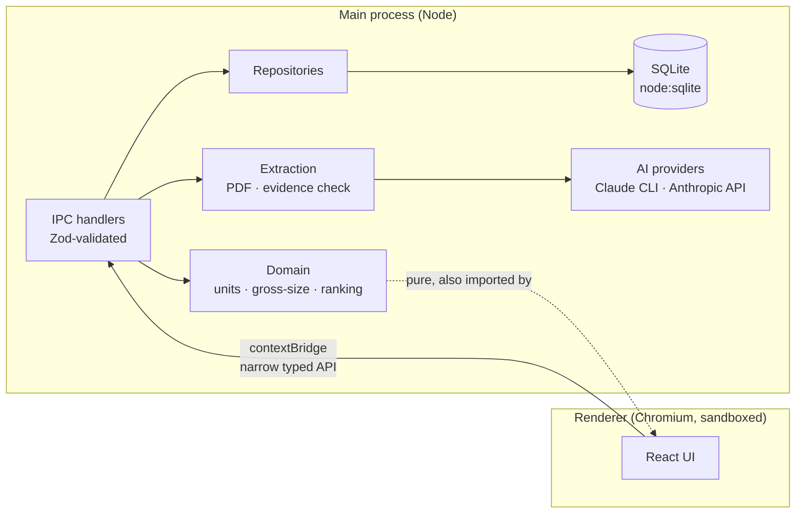
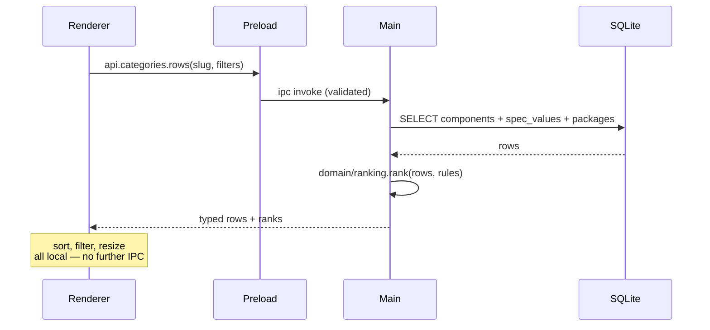

# Architecture

## Stack

| Layer | Choice | Why |
|---|---|---|
| Shell | Electron 43 | Local file access, PDF processing, optional CLI invocation, straightforward Windows packaging |
| UI | React 19 + TypeScript + Vite | Fast HMR, mature table ecosystem |
| Build | electron-vite | One config for main / preload / renderer |
| Database | **`node:sqlite`** | Built into Node 24.18.1, which is exactly what Electron 43 bundles |
| Validation | Zod | One schema shared by IPC boundary and AI output validation |
| Table | TanStack Table + Virtual | Sticky headers, resizing, virtualization for large categories |

### Why not Tauri

The brief allowed a change with justification. There is no justification here. Tauri would
move PDF parsing and datasheet ingestion into Rust or into a fragile sidecar, and the
optional Claude CLI provider wants a Node process anyway. Electron's cost is binary size,
which does not matter for a local engineering tool.

### Why `node:sqlite` and not `better-sqlite3`

`better-sqlite3` is a native module. `electron-rebuild` compiles it for Electron's ABI,
which then cannot be loaded by Vitest running on system Node — so database and migration
tests would validate a *different* binding than the one shipped.

Electron 43 bundles Node 24.18.1, byte-identical to the development Node here, and
`node:sqlite` is built into it (verified: SQLite 3.53.1, FTS5 working, no flag needed).
Result: zero native modules, no `node-gyp` on the Windows path, and tests exercise the
production driver.

One wrinkle, documented in `src/db/driver.ts`: `node:sqlite` is a **prefix-only** builtin.
`module.builtinModules` contains `"node:sqlite"` but not `"sqlite"`. Vite strips the
`node:` prefix before checking that list, concludes it is a package called `sqlite`, and
fails to resolve it. The driver loads it through `createRequire` to keep it out of static
analysis.

---

## Process model



The renderer has **no** Node access, no filesystem, no database handle. It calls a small
named API surface exposed by the preload script. Pure domain code (units, area maths,
gross-size calculation) is imported directly by both sides, so the UI can recalculate a
gross size as you toggle an external without an IPC round trip.

### Security posture

- `contextIsolation: true`, `nodeIntegration: false`, `sandbox: true`
- Preload exposes named methods only — never `ipcRenderer` itself
- Every IPC payload is parsed by a Zod schema in the main process before reaching a
  repository; a validation failure is an error, not a coerced value
- No shell interpolation anywhere. The Claude CLI provider builds an `argv` array with a
  fixed flag set and passes file paths as arguments, never through a shell string
- `Content-Security-Policy` on the renderer; external navigation and new windows blocked
- API keys live in the OS credential store, never in the repo or the database

---

## Module boundaries

```
src/
  main/          Electron main: window lifecycle, IPC registration, dialogs
  preload/       contextBridge surface (the only renderer capability)
  db/
    driver.ts        node:sqlite wrapper (SqlDriver interface)
    migrations/      NNN_name.sql, applied transactionally via user_version
    repositories/    SQL only — no business logic
  domain/          Pure, dependency-free, fully unit tested
    units/           dimension registry, parse, convert, format
    physical/        package dimensions, footprint, area
    gross-size/      externals, profiles, estimator
    ranking/         rule evaluation
    categories/      category and spec-definition types
  import/
    config-yaml/     component-report importer + spec lexicon
    seed/            parts.json -> unverified component stubs
  extraction/      PDF text/render, evidence verification, review diffing
  ai/              Provider interface and implementations
  renderer/        React UI
resources/
  spec-lexicon.yaml  phrase -> typed spec mapping (editable, no release needed)
```

**The rule:** `domain/` imports nothing from `db/`, `ai/` or `renderer/`. It is plain
functions over plain data, which is why the calculations that matter can be tested
exhaustively without a database or a running app.

Repositories contain SQL and nothing else. Business rules live in `domain/`. This is what
keeps "which dimension basis do we use for area" a single tested function rather than a
decision re-made in four query sites.

---

## Data flow: opening a category



No LLM is involved in browsing, filtering, sorting or comparing. AI runs only during an
explicit ingestion or re-extraction action.

---

## Testing strategy

| Level | What |
|---|---|
| Unit | Unit conversion, range logic, area basis selection, gross-size maths, ranking, lexicon resolution |
| Integration | Migrations, category import and re-sync, component CRUD, manual-override protection |
| UI | The critical path: Add → Datasheet → Review → Save → Category → Compare |

Tests are written to fail *loudly and specifically*. `package.area.test` asserts the exact
figure `5.46 mm²`, so substituting nominal dimensions turns one named test red rather than
shifting a number nobody checks.
