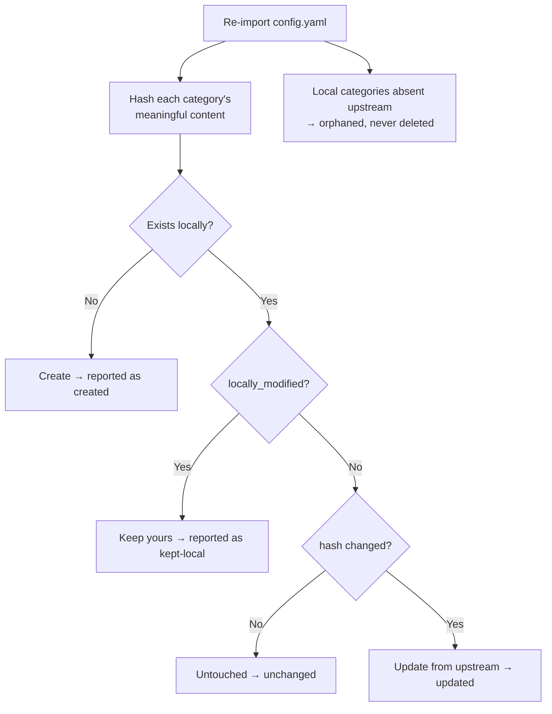

# Category Schema and the Spec Lexicon

Adding a category, or changing which parameters matter inside one, must never require a
code change. No category slug and no spec key appears in a `switch` statement anywhere in
this codebase.

---

## What a category is

```ts
interface Category {
  slug: string             // stable identity, shared with component-report
  name: string
  group: string            // nav grouping: Power, Wireless, MCU, FPGA, Memory, RF, …
  description: string
  ranking: CategoryRanking
  specs: SpecDefinition[]
  manufacturers: string[]  // preferred, for filter suggestions
  referenceParts: string[] // best_in_class NAMES only — never specifications
  importNotes: string[]
}
```

```ts
interface SpecDefinition {
  key: string              // 'iq', 'vin_range', 'rx_sensitivity'
  name: string             // 'Quiescent current'
  type: 'scalar' | 'range' | 'number' | 'bool' | 'enum' | 'text'
  dimension?: DimensionId  // required for scalar/range
  unit?: string            // preferred display unit; storage is canonical
  better: 'lower' | 'higher' | 'none'
  enumValues?: string[]
  table: boolean           // default table column
  filterable: boolean
  sortable: boolean
  ai?: string              // extraction guidance
  unmapped: boolean        // importer could not type it — needs your attention
  sourcePhrase?: string    // verbatim upstream text, for traceability
}
```

`better` drives comparison highlighting. A spec marked `none` is **never** tinted
best/worst, because "higher switching frequency" is not better or worse — it is a
trade-off. Colouring it would be an opinion the data does not support.

---

## The hard problem

`component-report/config.yaml` does not contain a schema. It contains research hints
written for a language model:

```yaml
key_parameters:
  - Package footprint (mm²) and type
  - Quiescent current (Iq)
  - Max output current
  - Dropout voltage
  - Vin / Vout range, PSRR
```

Across 36 categories that is **205 references to 100 distinct free-text strings**, where:

- `"Vin / Vout range, PSRR"` is **three** specifications in one string
- `"Package footprint (mm²)"` (21 uses) is a value the app **derives**, not stores
- `"Features (slew control, reverse blocking, mux/priority)"` is an open-ended list
- `"Flash / RAM"` is two dimensioned quantities

No amount of string munging turns these into types correctly, and calling an LLM at import
time would make the import non-reproducible, non-reviewable and dependent on a network.

## The solution: a shipped, editable lexicon

`resources/spec-lexicon.yaml` maps each phrase to one or more typed definitions.

```yaml
- match: "Quiescent current (Iq)"
  emits:
    - { key: iq, name: Quiescent current, type: scalar,
        dimension: current, unit: µA, better: lower, table: true,
        ai: "Quiescent (ground) current at no load, typical." }

- match: "Vin / Vout range, PSRR"          # one phrase, three specs
  emits:
    - { key: vin_range,  type: range,  dimension: voltage, unit: V }
    - { key: vout_range, type: range,  dimension: voltage, unit: V }
    - { key: psrr,       type: scalar, dimension: ratio_log, unit: dB, better: higher }

- match: "Package footprint (mm²)"          # derived, creates no stored spec
  emits: [{ virtual: "@ic_area" }]
```

Matching normalizes case, whitespace and punctuation, so `mm²` and `mm2` are one key.

**All 100 distinct phrases are mapped.** A test asserts `unmappedPhrases` is empty, so a
future upstream phrase that nobody has typed shows up as a failing test rather than as a
silently degraded column.

### When a phrase is not in the lexicon

It becomes a single `text` spec flagged `unmapped: true`, keeping its original wording as
the display name, and appears in the category editor under **Needs typing**. It is never
dropped and never guessed. Partial lexicon coverage still produces a working import.

---

## Virtual fields

Derived values, prefixed `@` so they cannot collide with a spec key:

| Field | Meaning |
|---|---|
| `@ic_area` | IC X × Y using maximum dimensions |
| `@gross_area` | Default profile's effective solution area |
| `@ic_width`, `@ic_height`, `@z_height` | Individual axes |
| `@external_count` | Number of included external parts |
| `@price_1k` | Unit price at 1 k |

---

## Ranking

`metric:` in the source is prose describing an ordered ranking:

> `"Smallest package footprint (mm²); then lowest quiescent current (Iq)"`

The importer splits on `;` and `then`, resolves each clause through the same lexicon, and
emits ordered rules:

```
1. @ic_area  asc   (missing → last)
2. iq        asc   (missing → last)
```

Size clauses map to `@gross_area` when the prose says *total solution*, otherwise
`@ic_area`. Direction comes from the prose's own words (`smallest`, `lowest`, `highest`),
falling back to the spec's `better`.

**The prose is always kept and displayed**, even when every clause resolves. If nothing
resolves, the category is flagged `unresolved` and shows the prose alone rather than an
invented ranking. Currently all 36 categories resolve to at least one rule.

### Hard requirements

Some categories carry disqualifying constraints. These become `RankingRequirement` rows:

```yaml
requirement: { field: isupply, op: "<", value: 6, unit: mA,
               note: "Hard constraint: on current must be under 6 mA." }
```

Failing components are **excluded from the ranking but still shown**, marked with the
requirement they miss. Silently vanishing rows are how you lose trust in a table.

---

## The YAML colon trap

Three real entries in `config.yaml` contain `": "` inside the text. YAML parses those list
items as **dictionaries, not strings**:

```yaml
- Supply / on current (HARD: must be < 6 mA)
```
parses as
```python
{'Supply / on current (HARD': 'must be < 6 mA)'}
```

Affected: `rf-lna-400mhz` (×2) and `fpga-pcie` (×1) — and two of the three carry the
category's *hard constraints*. Any consumer iterating `key_parameters` as `string[]` either
throws or silently drops them.

`flattenKeyParameter()` rebuilds `"key: value"` verbatim, so the text survives, matches the
lexicon, and produces the typed requirement. A test feeds the real fixture and asserts
`rf-lna-400mhz` still carries `isupply < 6 mA` and `band_coverage covers 400 MHz`.

> This is worth fixing upstream in `component-report` too — quoting those strings would
> make them parse as intended.

---

## Non-destructive sync



Every imported row stores a SHA-256 of the upstream content it was built from. This
distinguishes *"upstream changed"* from *"you changed it"* — without it, the sync cannot
tell a genuine update from your edit and would have to guess.

The hash covers meaningful content only: reordering a manufacturer list is not a change.

Editing a category or a spec sets `locally_modified`, and from then on sync leaves it
alone and reports it in `keptLocal`. Categories that disappear upstream are reported as
`orphaned` and kept. **Nothing is ever deleted by a sync.**

---

## Extending

Adding a category needs no code:

1. Add it in the app's category editor, **or** add it to `config.yaml` and re-import
2. If a new parameter phrase is unrecognised, either type it in the editor or add an entry
   to `resources/spec-lexicon.yaml`

Categories in the product brief that upstream does not yet define — cellular, GNSS,
Wi-Fi HaLow, MEMS microphone, sensors, generic memory, MCU-without-RF — are exactly this
case, and are the reason the requirement exists.
