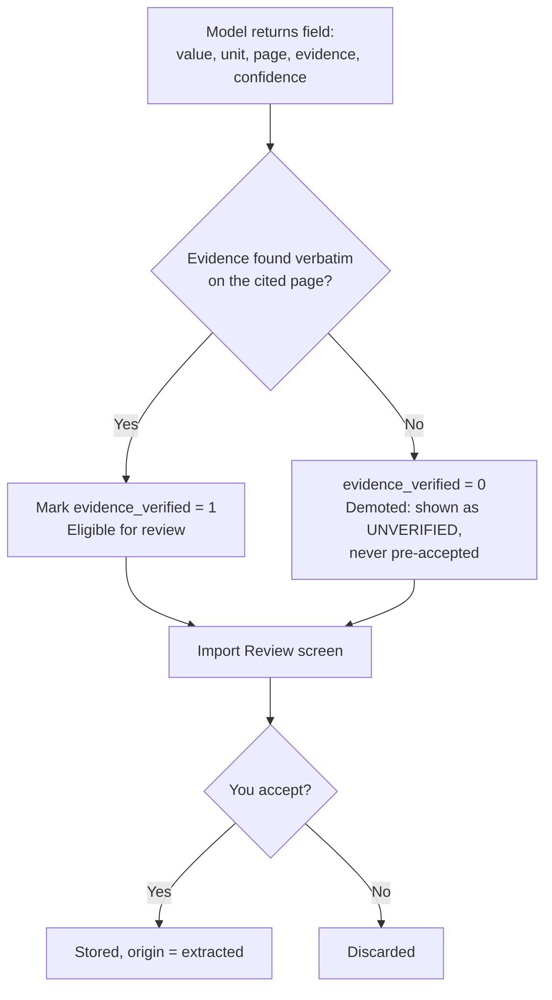

# Datasheet Extraction

> **Status: designed, interfaces stubbed, not yet implemented.** Nothing in the shipped
> code calls a model. This document is the contract phase 5 is built against.

The application is fully usable without AI. Extraction is an assistant for data entry, and
it is never trusted.

---

## The requirement that shapes everything

**Never invent an engineering specification.** A value that cannot be found confidently is
stored as `null` / `Unknown`. This is not a prompt instruction to be hoped for — a prompt
saying "do not hallucinate" is a request, not a guarantee. It needs a mechanism.

## The mechanism: evidence must be verifiable

Every extracted field must return a verbatim `evidence` quote and a `page`. Before anything
is stored, the pipeline searches for that quote in the text actually extracted from that
page.



A model that fabricates a number must also fabricate a quote that happens to appear in the
PDF text. That is a far harder failure to produce by accident, and it converts an unfalsifiable
claim into a checkable one.

Comparison is whitespace- and case-normalized, since PDF text extraction mangles spacing.

---

## Pipeline

```mermaid
flowchart LR
  A["PDF dropped"] --> B["Text layer via PDF.js"]
  B --> C{"Enough text?"}
  C -->|No| V["Render pages to images<br/>→ model vision"]
  C -->|Yes| D["Identify part + package variants"]
  V --> D
  D --> E{"One variant<br/>for this MPN?"}
  E -->|No| P["Ask which package<br/>— never guess"]
  E -->|Yes| F["Suggest category"]
  P --> F
  F --> G["Extract that category's<br/>key_parameters"]
  G --> H["Extract mechanical drawing:<br/>min / nom / MAX per axis"]
  H --> I["Optionally suggest externals<br/>from the application circuit"]
  I --> J["Verify every evidence quote"]
  J --> K["Import Review screen"]
  K --> L["You approve → saved"]
```



**Nothing is saved before review.** There is no auto-accept threshold, not even for high
confidence. Confidence is displayed, never acted on.

### Exact ordering code matters

A datasheet often covers a whole family: QFN, BGA and WLCSP with different dimensions. The
pipeline identifies the package variants present, and if the entered MPN does not
unambiguously select one, **it asks**. Guessing here silently attaches the wrong physical
size to a part — in an app whose entire purpose is physical size.

### Dimensions specifically

The mechanical drawing table is extracted per axis as a min/nominal/max triplet. When the
datasheet gives maxima, they are stored, and area uses them. The extraction prompt asks for
all three explicitly rather than "the package size", because "the package size" is the
question that produces the nominal.

### Suggested externals

From the typical application circuit, minimum application circuit, or hardware design
guide. Each suggestion carries a necessity (`required` / `recommended` / `optional` /
`configuration`) and its source reference, and lands in a **pending** state that does not
affect gross size until you approve it.

---

## Provider abstraction

One interface; no provider-specific code anywhere else.

```ts
interface ExtractionProvider {
  readonly id: 'claude-cli' | 'anthropic-api'
  isAvailable(): Promise<boolean>
  extract(request: ExtractionRequest): Promise<ExtractionResult>
}
```

| Provider | Notes |
|---|---|
| **Claude CLI** (default) | Spawns the local `claude` binary, matching `component-report`'s `backend: cli`. Uses your subscription, no API credits. |
| **Anthropic API** | Key from the OS credential store. Never in the repo or the database. |

**CLI security.** Fixed `argv` array, never a shell string. A fixed flag set; the binary
path comes from settings and is validated to be an existing executable. No user-controlled
value ever reaches a shell.

---

## Schema validation

Model output is parsed against a Zod schema before touching the database. Every field is:

```ts
{
  value: number | string | boolean | null   // null is a legitimate, expected answer
  unit: string | null
  page: number | null
  evidence: string | null
  confidence: number                        // 0..1, displayed only
}
```

Anything failing validation is rejected outright rather than coerced. A malformed
extraction is an error you see, not a partially-populated component.

---

## Re-extraction

Datasheets get revised. Reprocessing produces a **diff**, never a silent mutation:

```
Max output current    300 mA  →  350 mA     [accept] [reject]
Package X (max)      2.60 mm  →  2.60 mm    unchanged
Iq                    25 nA   →  (not found) keeps existing
```

- Values you edited (`origin = 'manual'`) are never changed without explicit approval
- "Accept all non-conflicting" applies only changes that do not touch a manual value
- A field the new extraction cannot find does **not** erase the old one

---

## Provenance in the UI

Any extracted value carries a small indicator. Clicking it shows:

```
Datasheet page 43 · confidence 0.82 · verified
"VIN  Input voltage range  1.5  —  5.5  V"
```

Unverified evidence is labelled as such. When a value came from a table, enough surrounding
context is kept for the row to be intelligible on its own.

---

## What is stubbed today

- `ai/Provider` interface and the two implementations' shapes
- Zod schemas for extraction output
- The evidence verifier (pure function, testable without a model)
- The review-screen data contract

In the UI, **Add → From Datasheet** is visible but disabled, with the reason stated, rather
than present and broken.
