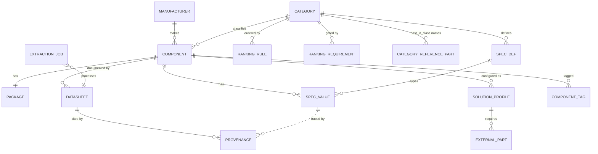

# Data Model

Local SQLite, one file, fully portable. No cloud, no lock-in. Schema version tracked in
`user_version`; migrations are numbered SQL files applied transactionally.

---

## The hybrid requirement

Category specs are dynamic, so they cannot be columns on `component` — that would mean
dozens of nullable columns and a migration every time a category gains a parameter. But
storing everything as one JSON blob loses typing, indexing and comparability.

The resolution: **universal fields are normalized columns; category-specific values live in
`spec_value` with typed numeric columns.**

```sql
CREATE TABLE spec_value (
  component_id   INTEGER NOT NULL,
  spec_def_id    INTEGER NOT NULL,
  kind           TEXT NOT NULL,     -- scalar|range|number|bool|enum|text
  num_min        REAL,              -- canonical SI, always populated for numerics
  num_typ        REAL,
  num_max        REAL,
  canonical_unit TEXT,
  display_unit   TEXT,              -- presentation only; never compared
  bool_val       INTEGER,
  text_val       TEXT,
  enum_val       TEXT,
  origin         TEXT NOT NULL,     -- manual|imported|extracted|derived
  is_unverified  INTEGER NOT NULL,
  confidence     REAL,
  UNIQUE (component_id, spec_def_id)
);
```

Filtering, sorting and ranking read `num_min` / `num_typ` / `num_max` **only**. A formatted
string is never the source of truth for a comparison. `0.5 mA` and `500 µA` both store
`5e-4` with `canonical_unit = 'A'`, differing only in `display_unit`.

A range fills `num_min` / `num_max`; a scalar fills `num_typ`. A one-sided bound
(`< 6 mA`) fills only `num_max` and leaves the other side genuinely null — the missing
bound is not backfilled.

---

## Entity map



---

## Physical dimensions

```sql
CREATE TABLE package (
  component_id INTEGER NOT NULL UNIQUE,
  type TEXT, name TEXT, pin_count INTEGER,
  x_min REAL, x_nom REAL, x_max REAL,
  y_min REAL, y_nom REAL, y_max REAL,
  z_min REAL, z_nom REAL, z_max REAL,
  origin TEXT NOT NULL,
  is_unverified INTEGER NOT NULL,
  unverified_reason TEXT
);
```

All nine cells are stored because datasheets give all nine. Area selection prefers **max**,
then nominal, then min, and reports which basis it used — per axis, so a part specified
max-on-X and nominal-only-on-Y reads as `mixed` rather than claiming a precision it lacks.

`UNIQUE (component_id)` is deliberate. A family available in QFN, BGA and WLCSP is **three
components**, not one with three sizes, because the ordering part number determines the
size and the whole app is about size.

`is_unverified` marks dimensions that have not been confirmed against a datasheet — chiefly
those parsed from `component-report` report prose. They render greyed and dashed, and are
**excluded from ranking** until confirmed.

---

## Provenance

```sql
CREATE TABLE provenance (
  subject_type      TEXT NOT NULL,   -- spec_value | package | component
  subject_id        INTEGER NOT NULL,
  datasheet_id      INTEGER,
  page              INTEGER,
  evidence          TEXT,            -- verbatim quote from the page
  evidence_verified INTEGER NOT NULL,-- quote found literally in the page text
  confidence        REAL,
  model             TEXT,
  extracted_at      TEXT NOT NULL
);
```

`evidence_verified` is the anti-hallucination mechanism, and it is mechanical rather than
promissory: the quoted evidence is searched for in the extracted page text, and a value
whose quote is not found is never stored as confirmed. See
[DATASHEET_EXTRACTION.md](DATASHEET_EXTRACTION.md).

---

## Origin and manual overrides

`origin` appears on `spec_value` and `package`:

| Origin | Meaning |
|---|---|
| `manual` | You typed it. Wins over everything. |
| `extracted` | An AI extraction you approved. |
| `imported` | From `component-report`, usually `is_unverified = 1`. |
| `derived` | Computed by the app. |

Re-extraction never overwrites `manual`. It produces a diff for you to accept or reject.
This is enforced in the repository layer and covered by test, not left to caller discipline.

---

## Duplicate detection

`UNIQUE (manufacturer_id, mpn_norm)` where `mpn_norm` is case- and separator-normalized.
Adding an existing part offers **open existing / create variant / update existing** — it
never overwrites silently.

---

## Search

FTS5 over `mpn`, `family`, `manufacturer`, `notes`, `tags`, tokenized with `-`, `_` and `.`
as word characters so `nRF54L15-CAAA-R` is findable by `nRF54`, and kept in sync by
triggers rather than by remembering to update it at every call site.

---

## Reference parts carry no specifications

`best_in_class` from `component-report` is imported into `category_reference_part` as
**names only**. Those entries are LLM-selected winners from a past report, not verified
measurements. Importing them as specification values would be fabricating datasheet data.

A test asserts that importing all 36 categories creates **zero** `component` rows and
**zero** `spec_value` rows.

---

## Portability, export and backup

The database is one SQLite file you own.

- **JSON export** — full fidelity, including provenance and profiles
- **CSV export** — the current category table, as displayed, with units in the headers
- **Backup / restore** — file copy, plus a schema-version check on restore
- **Bulk CSV import** — planned for phase 6

`assertNotNewerThan()` refuses to open a database written by a newer build rather than
partially migrating it and corrupting data.
