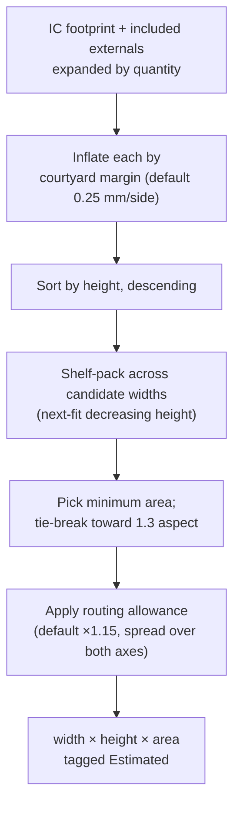
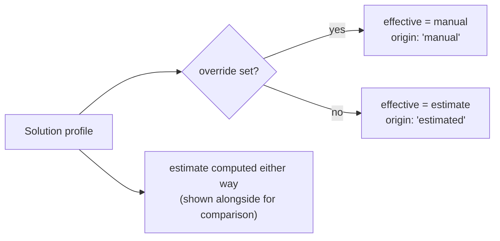

# Gross Solution Size

The feature this application exists for.

A package size tells you how big the chip is. It does not tell you how much board you have
to give up to use it. A 0.64 × 0.64 mm LDO in a DSBGA is 0.41 mm² of silicon and perhaps
2.5 mm² of board once you place the input and output capacitors with survivable clearances.
An MCU with an integrated DC-DC and balun can beat a physically smaller one that needs a
crystal, two load caps, a matching network and an inductor.

**This is the number that decides parts. So it is a first-class, editable, traceable field.**

---

## Four measurements, never conflated

| | Name | Definition | Field |
|---|---|---|---|
| **A** | IC area | IC X × Y, using **maximum** dimensions | `icAreaMm2` |
| **B** | External area | Σ (qty × package area) over *included* externals | `externalAreaMm2` |
| **C** | Gross component area | A + B | `grossComponentAreaMm2` |
| **D** | Estimated PCB rectangle | Bounding rectangle for the whole solution | `estimate` |

They are separate fields on `SolutionSize` because they answer different questions, and
because the failure mode this guards against is presenting one as another.

- **C is not a board area.** It is the sum of component footprints, with no room between
  them. Nothing can be built at C.
- **D is not a layout.** It is a heuristic with named assumptions, and you can overrule it.

```
IC                    3.00 × 3.00 mm  =  9.00 mm²      (A)
Required externals                       7.40 mm²      (B)
Gross component area                    16.40 mm²      (C)
Estimated PCB solution  5.20 × 4.40 mm = 22.88 mm²     (D)  Estimated
```

---

## The estimator

`estimateRectangle()` in `src/domain/gross-size/estimate.ts`.



### Assumptions, and why they are visible

| Setting | Default | Meaning |
|---|---|---|
| `courtyardMarginMm` | 0.25 | Keepout added around every part, per side |
| `routingAllowance` | 1.15 | Multiplier for fanout, vias and placement reality |
| `targetAspect` | 1.3 | Preferred width:height when several packings tie on area |

All three are configurable and travel *with* the result on `estimate.settings`, so the UI
can state what produced the number. An estimate whose assumptions are invisible is a
number that will eventually be quoted as a measurement.

### Properties the tests enforce

- **Deterministic.** No randomness, no clock. The same BOM always yields the same figure —
  asserted by computing it ten times and comparing.
- **Order-independent.** Reordering the externals does not change the answer.
- **D > C always.** Courtyards and routing allowance guarantee it. A D ≤ C would mean the
  estimator had quietly started reporting component area as board area.
- **Monotonic in margin.** A larger courtyard produces a larger board.

### What it deliberately does not do

It does not model thermal relief, RF keepouts, layer count, connector access, mechanical
constraints, or the fact that a crystal wants to be near its pins. It is a *first estimate*
to make categories comparable. When you know better, you type the real number.

---

## Manual override



An override always wins, and the estimate is still computed and displayed next to it so you
can see the disagreement. Recomputing never mutates the manual value — asserted by
recomputing five times and comparing.

Either form is accepted:
- width + height → area derived
- area alone → stored as-is, with **no invented width and height**

The UI marks the two origins distinctly. `Manual` and `Estimated` never look the same.

---

## The external component model

Each external carries:

| Field | Purpose |
|---|---|
| `name`, `function` | "10 µF", "VDD decoupling" |
| `qty` | Multiplies into B and into the packing |
| `necessity` | `required` / `recommended` / `optional` / `configuration` |
| `valueText` | "32 MHz", "2.2 µH" — kept as text; the value is not what costs area |
| `packageName`, `xMm`, `yMm`, `zMm` | What actually consumes board |
| `included` | In or out of the calculation, without deleting the row |
| `sourceRef` | Datasheet page, app note, or your own experience |

`included` is the important one. Toggling it recalculates B, C and D immediately — in the
renderer, with no IPC round trip, because the calculation is pure. That is what makes
"what if I drop the LF crystal?" a one-click question.

An included external with no dimensions is **not** silently skipped: it is reported by name
in `estimate.undimensionedParts` and surfaced as a warning.

---

## Solution profiles

One component, several valid configurations:

- **Minimum BOM** — nothing optional
- **Recommended** — the datasheet's typical application circuit
- **Low-power** — adds the 32.768 kHz crystal
- **DCDC enabled** vs **LDO mode** — different inductor and cap sets
- **Reference design** — everything the eval board has

Each profile owns its external BOM, its override and its notes. One is the default, and
that is the one category ranking uses when it sorts by `@gross_area`.

The nRF case from the brief: a minimum configuration with no LF crystal, and a low-power
configuration with one. Same part, two honest answers, and you choose which one your
comparison is about.

---

## Interaction with ranking

`@gross_area` is a virtual ranking field resolving to the default profile's *effective*
area — manual if set, estimate otherwise. Categories whose `metric` mentions total solution
size get `@gross_area`; the rest get `@ic_area`.

From the real `config.yaml`:

| Category | Metric prose | Resolved primary rule |
|---|---|---|
| `tiny-ldo` | "Smallest package footprint (mm²); then lowest Iq" | `@ic_area` asc, then `iq` asc |
| `buck-5v-3v3` | "Smallest **total solution** footprint (IC + inductor + caps)" | `@gross_area` asc |

A component whose gross size is unknown ranks last rather than ranking first on a zero.
